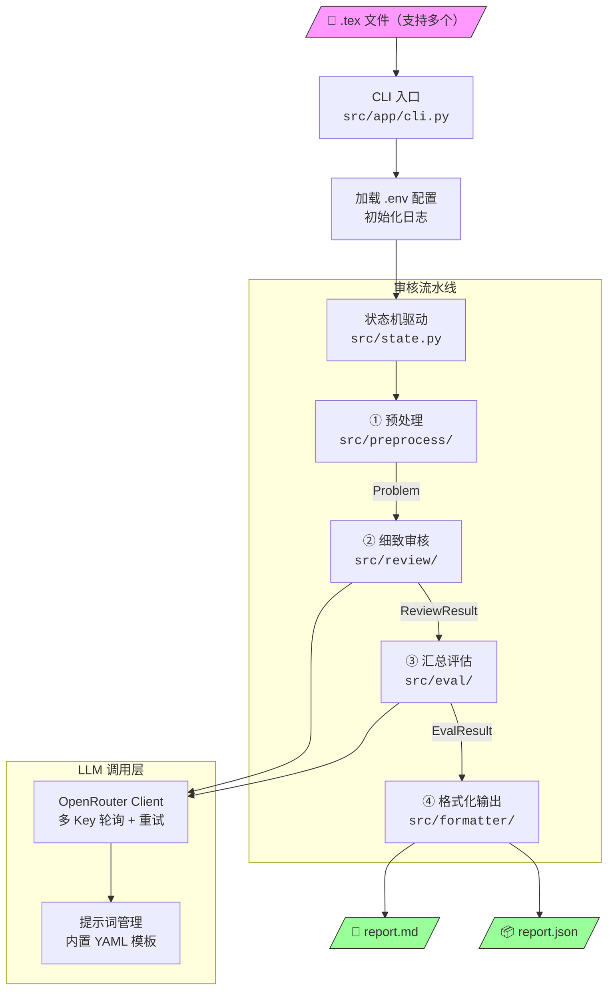
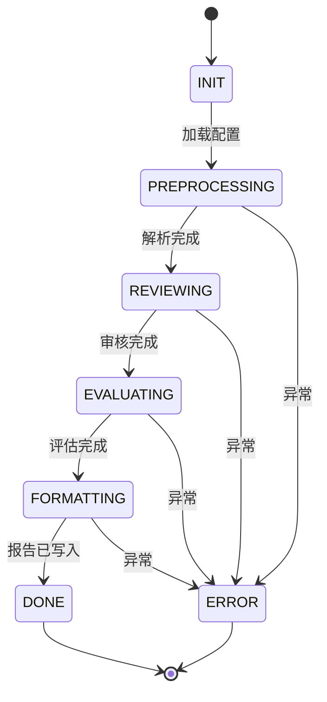
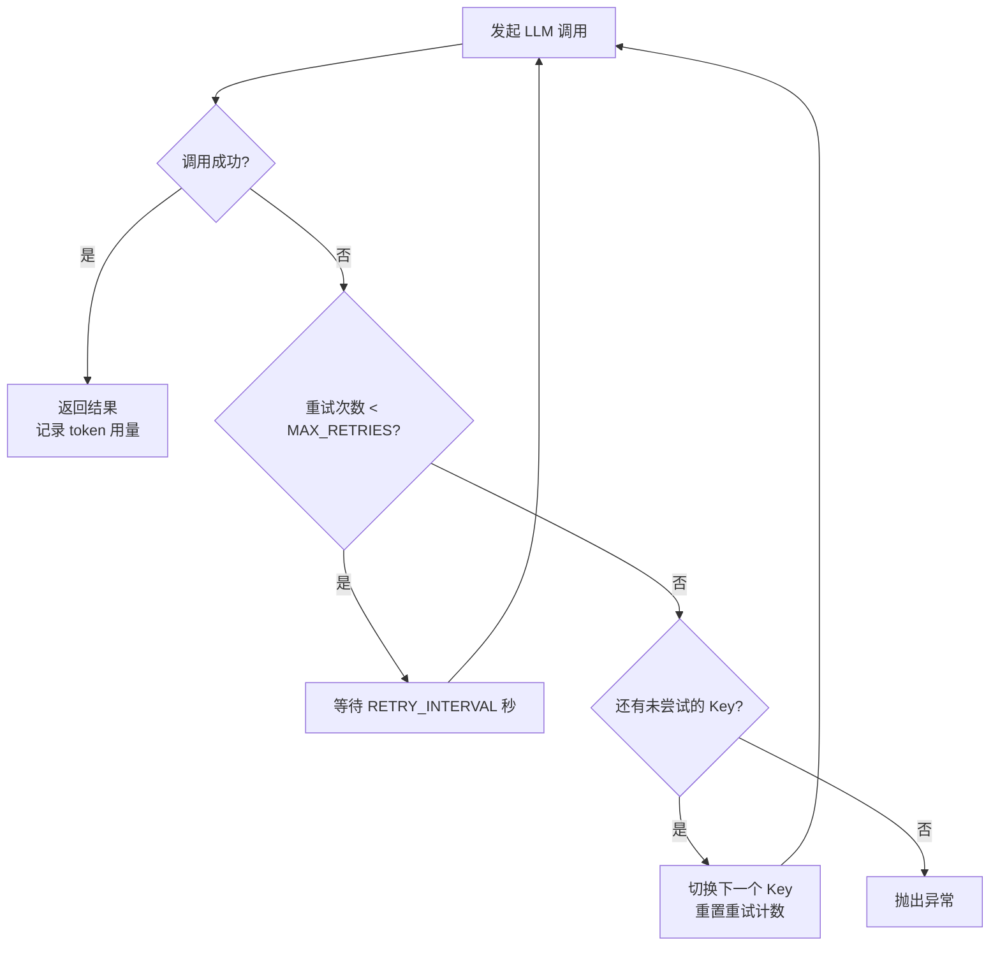
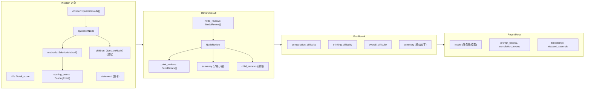
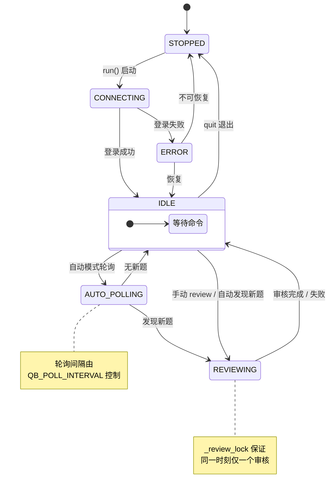

# 开发指南

## 项目结构

```
src/
├── __init__.py
├── state.py                     # 全局状态机（含日志 + 计时）
├── model/
│   └── __init__.py              # 数据模型 (Problem, ReviewResult, EvalResult, ReportMeta …)
├── config/
│   └── __init__.py              # 全局配置 (LLMConfig, QBConfig, AppConfig)
├── client/
│   ├── base.py                  # LLM 客户端基类 (ChatResponse, UsageStats)
│   └── openrouter.py            # OpenRouter 实现 (多 Key 轮询 + 重试)
├── prompt/
│   ├── manager.py               # YAML 提示词加载与渲染
│   └── templates/               # 内置提示词模板
│       ├── review_point.yaml    #   评分点审核
│       ├── review_summary.yaml  #   子题小结
│       └── comprehensive_eval.yaml  # 汇总评估
├── app/
│   ├── cli.py                   # CLI 入口（local / server 子命令）
│   └── server.py                # 题库服务器模式（交互式命令 + 自动轮询）
├── preprocess/
│   └── parser.py                # TeX 解析器
├── review/
│   └── reviewer.py              # 细致审核 (逐评分点 + 多解法)
├── eval/
│   └── evaluator.py             # 汇总评估 (三维难度 + 总结)
└── formatter/
    └── output.py                # Markdown + JSON 双格式输出（含元数据）
tests/
└── cases/                       # 测试用 .tex 文件
```

## 工作流



### 阶段说明

| 阶段 | 模块 | 输入 | 输出 | 说明 |
|------|------|------|------|------|
| 预处理 | `preprocess/` | `.tex` 文件路径 | `Problem` | 解析题干/解答，提取层级结构与评分点 |
| 细致审核 | `review/` | `Problem` | `ReviewResult` | 逐评分点（含多解法）审核正确性、合理性、难度；后续子题可引用前序审核结果 |
| 汇总评估 | `eval/` | `Problem` + `ReviewResult` | `EvalResult` | 三维难度评分 + 总结文字 |
| 格式化输出 | `formatter/` | 全部结果 + `ReportMeta` | `.md` + `.json` 文件 | 含元数据的双格式报告 |

### 状态机



### API Key 轮询与重试



## 数据模型



### 题目层级

LaTeX 模板支持四级小问，数据模型通过 `QuestionNode` 递归表示：

```
Problem
├── Part  (\pmark / \solPart)           ← 可选
│   └── SubQ  (\subq / \solsubq)        ← 一级小问
│       └── SubSubQ  (\subsubq / \solsubsubq)
│           └── SubSubSubQ  (\subsubsubq / \solsubsubsubq)
└── SubQ  (无 Part 时直接挂载)
```

### 评分点类型

| 标记 | 类型 | 说明 |
|------|------|------|
| `\eqtagscore{tag}{score}` | `EQUATION` | 方程评分点，计入分值 |
| `\eqtag{tag}` | — | 仅编号，不计分 |
| `\addtext{desc}{score}` | `TEXT` | 文字评分点，计入分值 |

## Server 模式架构

### 服务状态机



| 状态 | 说明 |
|------|------|
| `STOPPED` | 未连接 |
| `CONNECTING` | 正在登录题库 |
| `IDLE` | 空闲，等待命令 |
| `REVIEWING` | 正在审核某道题 |
| `AUTO_POLLING` | 正在查询新题 |
| `ERROR` | 出错 |

### 自动模式判定标准

一道题被判定为"需要审核的新题"需同时满足：

1. `status == "none"`（未经人工审核）
2. `updated_at` 晚于服务启动时间
3. 本次运行期内尚未审核过（内存缓存去重）
4. 当前不在 in-flight 审核集合中（避免 auto 重复提交）

### Server 并发策略

- `QB_MAX_CONCURRENT_REVIEWS` 控制 server 模式最多同时维持的审核任务数
- 手动 `review` 与 auto 轮询共用同一组并发槽位
- 手动提交在满载时立即返回“队列已满”
- auto 提交在满载时等待空闲槽位，再继续调度后续新题

### 审核结果回写

审核完成后调用 v0.1.0 SDK 专用接口：

- 难度标签存在时：`update_question_difficulty(question_id, bot_username, overall_difficulty, notes=markdown_report)`
- 难度标签不存在时：`create_question_difficulty(question_id, bot_username, overall_difficulty, notes=markdown_report)`
- `update_question_status(question_id, "reviewed")`

## 鲁棒性设计

- **LLM 回复解析重试**：LLM 回复无法解析为有效标签格式时，自动重试最多 2 次（`max_parse_retries=2`），共 3 次请求。
- **枚举值容错**：LLM 可能返回不在预定义枚举中的值（如 `correctness: "questionable"`），解析时 `try/except` 回退到默认值而不崩溃。
- **解析失败标记**：重试耗尽后仍无法解析时，标记 `parse_failed=True` 并保存原始回复（`raw_response`），报告中以 ⛔ 标识，不影响其余评分点。
- **前序审核上下文**：审核后续子题时，已完成子题的审核结论会作为上下文传入 LLM，使其能感知前后子题间的逻辑依赖。
- **多 Key 轮询**：某个 API Key 调用失败并达到最大重试次数后，自动切换到下一个 Key。

## 测试

```bash
# 运行全部测试
uv run pytest

# 带详细输出
uv run pytest -v --tb=short

# 运行单个测试文件
uv run pytest tests/test_reviewer.py -v
```

测试覆盖：

| 测试文件 | 覆盖模块 |
|----------|----------|
| `test_cli.py` | CLI 参数解析、task_id 生成 |
| `test_state.py` | 状态机流转、输出文件 |
| `test_parser.py` | TeX 解析器 |
| `test_reviewer.py` | 审核逻辑、解析重试 |
| `test_evaluator.py` | 汇总评估、解析重试 |
| `test_formatter.py` | 报告格式化 |
