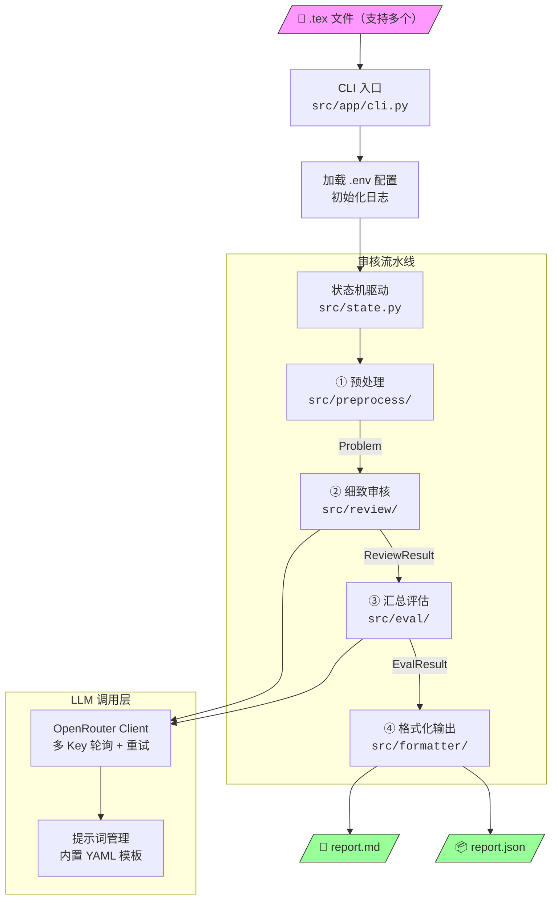
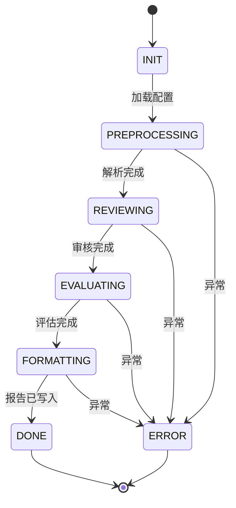
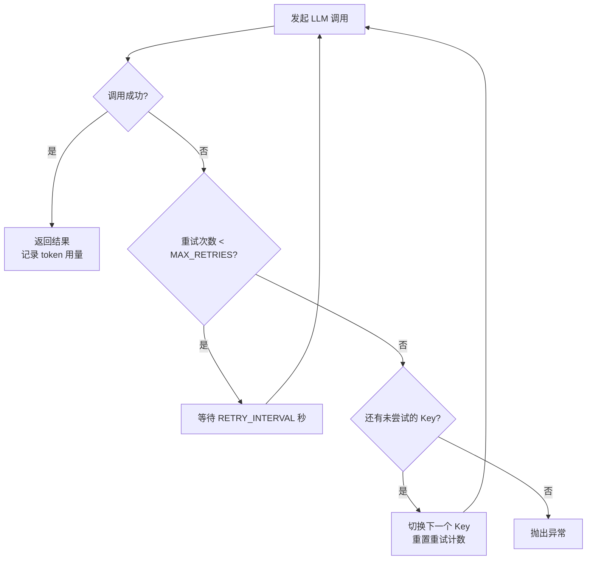
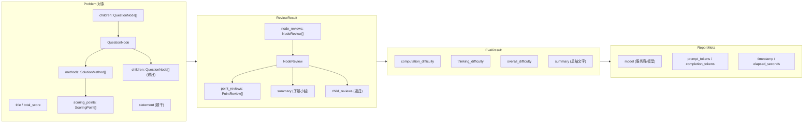

# AI Reviewer

CPHOS 物理竞赛题目 AI 审核工作流。自动解析 LaTeX 题目文件，对每个评分点进行数学正确性、物理合理性与难度评估，输出结构化审核报告（Markdown + JSON）。支持多文件并发审核。

## 工作流



### 阶段说明

| 阶段 | 模块 | 输入 | 输出 | 说明 |
|------|------|------|------|------|
| 预处理 | `preprocess/` | `.tex` 文件路径 | `Problem` | 解析题干/解答，提取层级结构与评分点 |
| 细致审核 | `review/` | `Problem` | `ReviewResult` | 逐评分点（含多解法）审核正确性、合理性、难度；后续子题可引用前序审核结果 |
| 汇总评估 | `eval/` | `Problem` + `ReviewResult` | `EvalResult` | 三维难度评分 + 总结文字 |
| 格式化输出 | `formatter/` | 全部结果 + `ReportMeta` | `.md` + `.json` 文件 | 含元数据的双格式报告 |

### 状态机



### API Key 轮询与重试



## 项目结构

```
src/
├── __init__.py
├── state.py                     # 全局状态机（含日志 + 计时）
├── model/
│   └── __init__.py              # 数据模型 (Problem, ReviewResult, EvalResult, ReportMeta …)
├── config/
│   └── __init__.py              # 全局配置 (LLMConfig, AppConfig)
├── client/
│   ├── base.py                  # LLM 客户端基类 (ChatResponse, UsageStats)
│   └── openrouter.py            # OpenRouter 实现 (多 Key 轮询 + 重试)
├── prompt/
│   ├── manager.py               # YAML 提示词加载与渲染
│   └── templates/               # 内置提示词模板
│       ├── review_point.yaml    #   评分点审核
│       ├── review_summary.yaml  #   子题小结
│       └── comprehensive_eval.yaml  # 汇总评估
├── app/
│   └── cli.py                   # CLI 入口
├── preprocess/
│   └── parser.py                # TeX 解析器
├── review/
│   └── reviewer.py              # 细致审核 (逐评分点 + 多解法)
├── eval/
│   └── evaluator.py             # 汇总评估 (三维难度 + 总结)
└── formatter/
    └── output.py                # Markdown + JSON 双格式输出（含元数据）
tests/
└── cases/                       # 测试用 .tex 文件
```

## 数据流



### 题目层级

LaTeX 模板支持四级小问，数据模型通过 `QuestionNode` 递归表示：

```
Problem
├── Part  (\pmark / \solPart)           ← 可选
│   └── SubQ  (\subq / \solsubq)        ← 一级小问
│       └── SubSubQ  (\subsubq / \solsubsubq)
│           └── SubSubSubQ  (\subsubsubq / \solsubsubsubq)
└── SubQ  (无 Part 时直接挂载)
```

### 评分点类型

| 标记 | 类型 | 说明 |
|------|------|------|
| `\eqtagscore{tag}{score}` | `EQUATION` | 方程评分点，计入分值 |
| `\eqtag{tag}` | — | 仅编号，不计分 |
| `\addtext{desc}{score}` | `TEXT` | 文字评分点，计入分值 |

## 快速开始

### 环境要求

- Python ≥ 3.12
- [uv](https://docs.astral.sh/uv/) 包管理器

### 安装

```bash
git clone <repo-url>
cd AI_Reviewer
cp .env.example .env
# 编辑 .env，填入 API Key（支持多个，逗号分隔）
uv sync
```

### 使用

```bash
# 审核单个题目（报告输出到 output/ 目录）
ai-reviewer problem.tex

# 审核多个题目（串行）
ai-reviewer orbit.tex penning_trap.tex stick.tex

# 并发审核（最多 3 个同时运行）
ai-reviewer orbit.tex penning_trap.tex stick.tex -j 3

# 指定输出目录
ai-reviewer problem.tex -o reports/
```

每个审核任务自动分配唯一 `task_id`（格式 `{文件名}_{8位hex}`），输出文件以此命名，避免重名覆盖：
- `output/orbit_a1b2c3d4.md` — Markdown 报告
- `output/orbit_a1b2c3d4.json` — JSON 结构化数据

并发数不会超过实际文件数（如 1 个文件 + `-j 3` 只启动 1 个任务）。

## 配置

复制 `.env.example` 为 `.env` 并填入配置：

| 变量 | 说明 | 默认值 |
|------|------|--------|
| `LLM_PROVIDER` | LLM 服务商 | `openrouter` |
| `OPENROUTER_API_KEY` | API 密钥（多个用逗号分隔，失败时轮询） | — |
| `OPENROUTER_BASE_URL` | API 地址 | `https://openrouter.ai/api/v1` |
| `LLM_MODEL` | 模型名称 | `anthropic/claude-sonnet-4` |
| `LLM_TEMPERATURE` | 温度参数 | `0.3` |
| `LLM_MAX_TOKENS` | 最大 token 数 | `4096` |
| `LLM_MAX_RETRIES` | 单个 Key 最大重试次数 | `3` |
| `LLM_RETRY_INTERVAL` | 重试间隔（秒） | `2` |
| `OUTPUT_DIR` | 报告输出目录 | `output` |

### 多 Key 配置示例

```env
OPENROUTER_API_KEY=sk-or-v1-key1,sk-or-v1-key2,sk-or-v1-key3
```

当某个 Key 调用失败并达到最大重试次数后，自动切换到下一个 Key 继续调用。

## 输出报告

### Markdown 报告包含

1. **概览表格** — 题目、总分、三维难度
2. **评分点总览表** — 编号、类型、分值、正确性、合理性、难度
3. **细致审核** — 按层级展开，每个子题附小结
4. **综合评估** — 总结文字
5. **元信息** — 使用模型、token 用量、生成时间、总耗时

### JSON 报告结构

顶层包含 `meta` 字段：

```json
{
  "meta": {
    "model": "openrouter/anthropic/claude-sonnet-4",
    "prompt_tokens": 12345,
    "completion_tokens": 6789,
    "total_tokens": 19134,
    "timestamp": "2026-04-06T12:00:00+08:00",
    "elapsed_seconds": 45.2
  },
  "title": "...",
  "total_score": 40,
  "difficulty": { ... },
  "summary": "...",
  "node_reviews": [ ... ]
}
```

## 鲁棒性设计

- **LaTeX 转义修复**：LLM 回复 JSON 中包含 `\vec`、`\nabla` 等 LaTeX 命令时，与 JSON 转义序列冲突（`\v` → 垂直制表符）。解析器自动检测并修复（`_fix_latex_escapes` 回退机制），同时提示词要求 LLM 双写反斜杠。
- **枚举值容错**：LLM 可能返回不在预定义枚举中的值（如 `correctness: "questionable"`），解析时 `try/except` 回退到默认值而不崩溃。
- **解析失败标记**：LLM 回复完全无法解析为 JSON 时，标记 `parse_failed=True` 并保存原始回复，报告中以 ⛔ 标识，不影响其余评分点。
- **前序审核上下文**：审核后续子题时，已完成子题的审核结论会作为上下文传入 LLM，使其能感知前后子题间的逻辑依赖。

## 开发

```bash
# 安装开发依赖
uv sync

# 运行测试
uv run pytest
```

## License

[AGPL v3.0](LICENSE)
